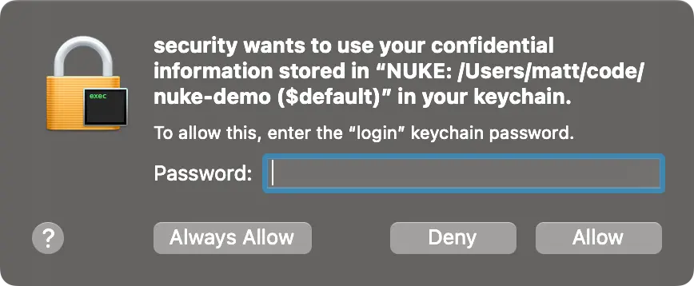

import AsciinemaPlayer from '../../src/components/AsciinemaPlayer';
import 'asciinema-player/dist/bundle/asciinema-player.css';

Historically, secret values like passwords or auth-tokens are often saved as environment variables on local machines or CI/CD servers. This imposes both, security issues because other processes can access these environment variables and inconveniences when a build must be executed locally for emergency reasons (server downtime). NUKE has an integrated encryption utility, which can be used to save and load secret values to and from [parameter files](../02-fundamentals/06-parameters.md#passing-values-through-parameter-files).

:::danger
Our [custom encryption utility](https://github.com/nuke-build/nuke/blob/develop/source/Nuke.Common/Utilities/EncryptionUtility.cs) is provided "AS IS" without warranty of any kind.

The implementation uses your password, a static salt, 10.000 iterations, and SHA256 to generate a [key-derivation function](https://docs.microsoft.com/en-us/dotnet/api/system.security.cryptography.rfc2898derivebytes) ([RFC2898](https://datatracker.ietf.org/doc/html/rfc2898)), which is then used to create a crypto-stream to encrypt and decrypt values via [Advanced Encryption Standard (AES)](https://en.wikipedia.org/wiki/Advanced_Encryption_Standard).

**Please review the implementation carefully and [contact us](mailto:info@nuke.build) about any possible flaws.**
:::

## Adding & Updating Secrets

You can start managing your secrets by calling:

```powershell
# terminal-command
nuke :secrets [profile]
```

When your parameter file does not contain secrets yet, you'll be prompted to choose a password. Otherwise, you have to provide the original password chosen.

:::tip
On macOS you can also choose to generate a password and save it to your [keychain](https://support.apple.com/guide/mac-help/use-keychains-to-store-passwords-mchlf375f392/mac) in order to profit from native security tooling.

<p style={{maxWidth:'420px',marginBottom:'-24px'}}>



</p>
:::

Afterwards, you can choose from a list of secret parameters, to either set or update their values, and finally accept or discard your changes:

<p style={{maxWidth:'700px'}}>
    <AsciinemaPlayer
        src="/casts/secrets.cast"
        idleTimeLimit={2}
        // autoplay={true}
        poster="npt:4.947343"
        preload={true}
        // terminalFontFamily="'JetBrains Mono', Consolas, Menlo, 'Bitstream Vera Sans Mono', monospace"
        loop={true}/>
</p>

When secrets are saved to a parameters file, they are prefixed with `v1:` to indicate the underlying encryption method:

```json title=".nuke/parameters.json"
{
  "$schema": "./build.schema.json",
  "NuGetApiKey": "v1:4VDyDmFs4Pf6IX8UvosDdjOgb23g0IXs0aP/MBqOK+K6TB8JuthtPgRUrUsi9tLD"
}
```

## Removing Secrets

If you want to delete a secret, you can simply remove it from the parameters file. In the event of a lost password, you have to remove all secrets and re-populate the parameters file via `nuke :secrets`.
